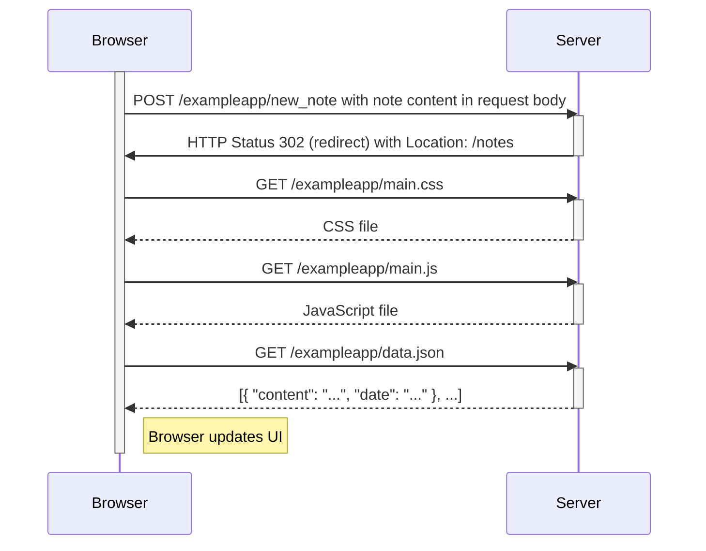

```mermaid
sequenceDiagram
  participant Browser
  participant Server

activate Browser
  Browser->>Server: POST /exampleapp/new_note with note content in request body
  activate Server
  Server->>Browser: HTTP Status 302 (redirect) with Location: /notes
  deactivate Server
  Browser->>Server: GET /exampleapp/main.css  
  activate Server
  Server-->>Browser: CSS file
  deactivate Server
  Browser->>Server: GET /exampleapp/main.js  
  activate Server
  Server-->>Browser: JavaScript file
  deactivate Server
  Browser->>Server: GET /exampleapp/data.json
  activate Server
  Server-->>Browser: [{ "content": "...", "date": "..." }, ...] 
  deactivate Server
  Note right of Browser: Browser updates UI
  deactivate Browser
```
