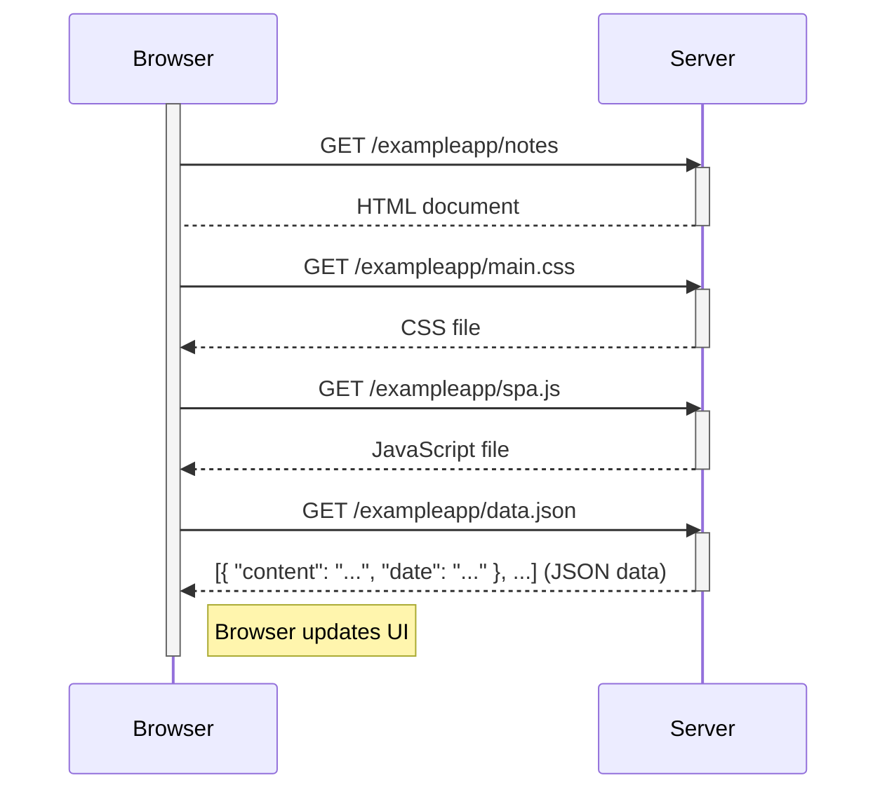

```mermaid
sequenceDiagram
  participant Browser
  participant Server

  activate Browser
  Browser->>Server: GET /exampleapp/notes
  activate Server
  Server-->Browser: HTML document
  deactivate Server
  Browser->>Server: GET /exampleapp/main.css
  activate Server
  Server-->>Browser: CSS file
  deactivate Server
  Browser->>Server: GET /exampleapp/spa.js
  activate Server
  Server-->>Browser: JavaScript file
  deactivate Server
  Browser->>Server: GET /exampleapp/data.json
  activate Server
  Server-->>Browser: [{ "content": "...", "date": "..." }, ...] (JSON data)
  deactivate Server
  Note right of Browser: Browser updates UI
  deactivate Browser
```
